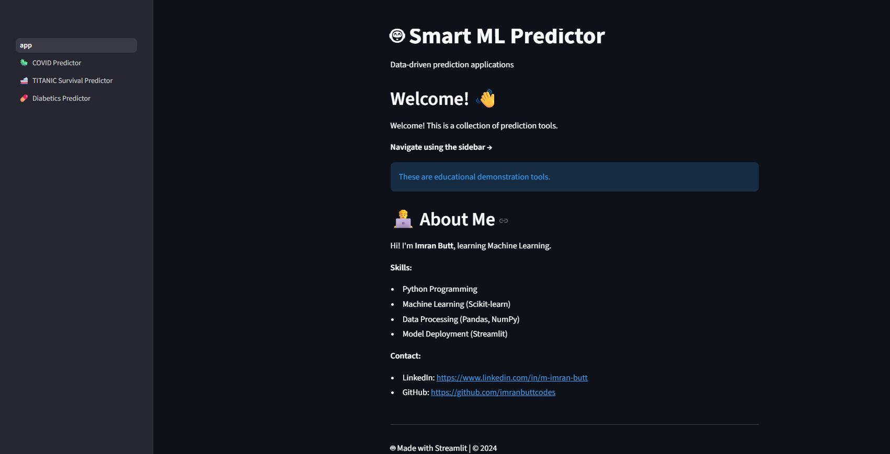
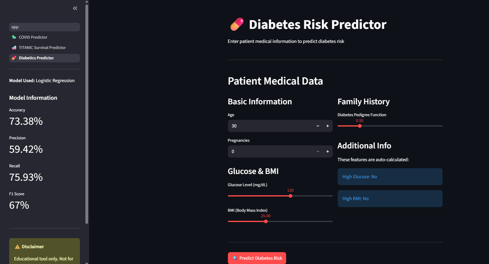
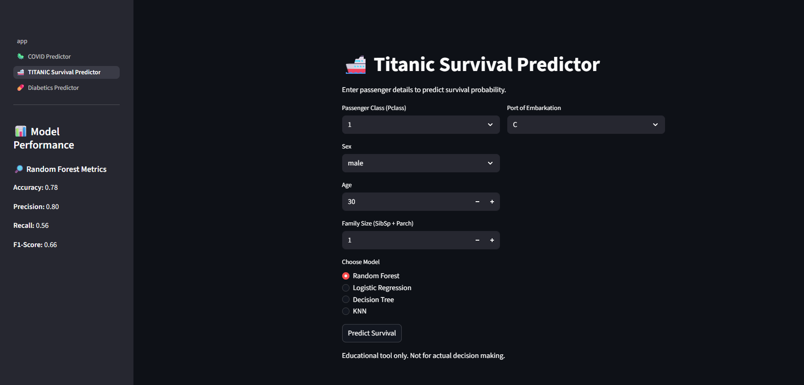
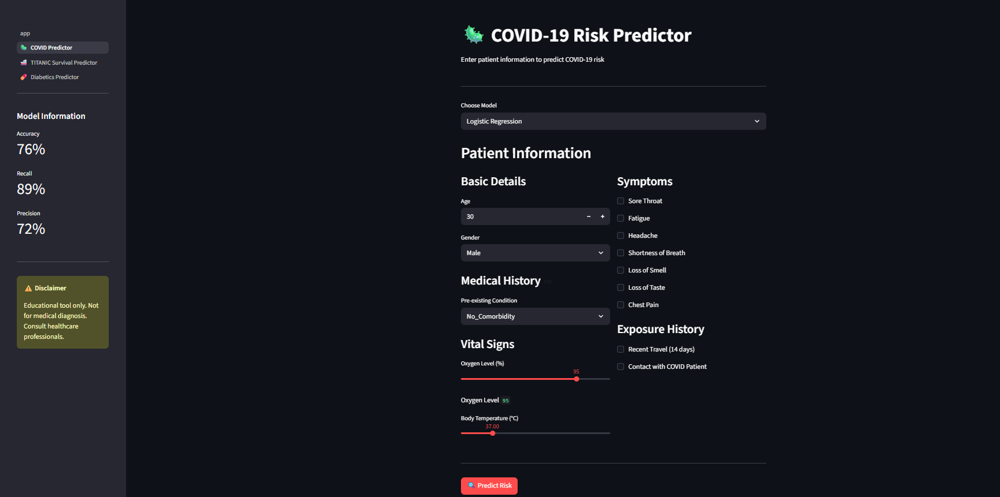

# 🤖 Smart ML Predictor

Smart ML Predictor is an educational collection of interactive machine learning prediction tools built with Python and Streamlit.  
It allows users to make predictions and generate PDF reports for:

- 💊 **Diabetes Risk Prediction**  
- 🚢 **Titanic Survival Prediction**  
- 🦠 **COVID-19 Risk Prediction**

---

## 📌 Features

- Interactive Streamlit UI for user-friendly input  
- Predict outcomes using trained ML models: Logistic Regression, Random Forest, Decision Tree, KNN  
- PDF report generation with:
  - Patient/passenger details
  - Prediction results
  - Probability charts
  - Recommendations
- Sidebar displays model performance metrics (accuracy, precision, recall, F1-score)  
- Educational demonstration — **not for real medical or life-critical decisions**

---

## 🚀 Live Demo

👉 **[Try it now!](https://imran-dev-smartmlpredictor.streamlit.app/)**

---

## 🛠️ Technologies Used

- Python   
- Streamlit  
- Pandas & NumPy  
- Scikit-learn  
- Matplotlib  
- FPDF  
- Joblib  

---

## 📁 Project Structure

```

SmartMLPredictor/
│
├── app.py                    # Main Streamlit app launcher
├── requirements.txt          # Python dependencies
├── README.md                 # Project documentation
│
├── models/                   # Pre-trained models & transformers
│   ├── diabetes_model.joblib
│   ├── diabetes_scaler.joblib
│   ├── rf_titanic_model.joblib
│   ├── lg_titanic_model.joblib
│   ├── dt_titanic_model.joblib
│   ├── knn_titanic_model.joblib
│   ├── titanic_encoder.joblib
│   ├── titanic_scaler.joblib
│   ├── corona_lg_model.joblib
│   ├── corona_rf_model.joblib
│   └── preprocessor.joblib
│
├── pages/                    # Individual app pages for Streamlit
│   ├── 1_🦠_Covid19_Risk_Predictor.py
│   ├── 2_ 🚢_TITANIC_Survival_Predictor.py
│   └── 3_ 💊_Diabetics_Predictor.py
│
├── screenshots/              # Screenshots for README.md or presentations
│   ├── home.png
│   ├── diabetes.png
│   ├── titanic.png
│   └── covid.png


---

## 🚀 Installation

1. Clone the repository:

```bash
git clone https://github.com/imranbuttcodes/SmartMLPredictor.git
cd SmartMLPredictor
````

2. Create a virtual environment (recommended):

```bash
python -m venv venv
# Activate the environment
# Windows:
venv\Scripts\activate
# Linux/macOS:
source venv/bin/activate
```

3. Install dependencies:

```bash
pip install -r requirements.txt
```

4. Run the main page:

```bash
streamlit run app.py
```

Navigate between modules using the sidebar, fill in input data, click **Predict**, and download PDF reports.


## 📋 Modules Overview

### 💊 Diabetes Risk Predictor

* **Inputs:** Age, Pregnancies, Glucose, BMI, Diabetes Pedigree Function, etc.
* **Output:** High/Low Risk
* **PDF report:** Includes probability chart and recommended actions

### 🚢 Titanic Survival Predictor

* **Inputs:** Passenger Class, Sex, Age, Family Size, Port of Embarkation
* **Output:** Survival Probability using selected model (RF, LG, DT, KNN)
* **PDF report:** Probability chart and passenger details

### 🦠 COVID-19 Risk Predictor

* **Inputs:** Age, Gender, Comorbidities, Symptoms, Vital Signs, Exposure History
* **Output:** High/Low Risk
* **PDF report:** Probability chart and recommendations for precautions

---

## ⚠️ Disclaimer

This project is for **educational purposes only**.
Predictions are **not medical advice** or real-life decision-making tools. Always consult a professional for health or safety concerns.

---

## 📫 Contact

**Muhammad Imran Butt**

* LinkedIn: [https://www.linkedin.com/in/m-imran-butt](https://www.linkedin.com/in/m-imran-butt)
* GitHub: [https://github.com/imranbuttcodes](https://github.com/imranbuttcodes)

---

## 🎨 Screenshots

### Home Page


*Main landing page with navigation to all prediction tools*

---

### 💊 Diabetes Predictor


*Predict diabetes risk based on medical metrics*

---

### 🚢 Titanic Survival Predictor


*Predict passenger survival with multiple ML models*

---

### 🦠 COVID-19 Risk Predictor


*Assess COVID-19 infection risk from symptoms*

## 📖 Usage Examples

### Diabetes Prediction
```bash
# Run the app
streamlit run app.py

# Navigate to "Diabetes Predictor" in sidebar
# Enter patient data:
# - Age: 45
# - Glucose: 150
# - BMI: 32
# - etc.

# Click "Predict Diabetes Risk"
# Download PDF report
```

### COVID-19 Prediction
```bash
# Navigate to "COVID-19 Predictor"
# Enter symptoms and vitals
# Get instant risk assessment
# Download detailed report
```

## 🙏 Acknowledgments

**Dataset Sources:**
- **Diabetes:** [Pima Indians Diabetes Database](https://www.kaggle.com/datasets/uciml/pima-indians-diabetes-database)
- **Titanic (Alternative):** [GitHub Raw Dataset](https://raw.githubusercontent.com/datasciencedojo/datasets/master/titanic.csv)
- **COVID-19:** [Patient Symptoms & Diagnosis Dataset](https://www.kaggle.com/datasets/miadul/covid-19-patient-symptoms-and-diagnosis-dataset)

**Built With:**
- [Streamlit](https://streamlit.io/) - Interactive web framework
- [Scikit-learn](https://scikit-learn.org/) - Machine Learning library
- [Pandas](https://pandas.pydata.org/) - Data manipulation and analysis
- [NumPy](https://numpy.org/) - Numerical computing
- [Matplotlib](https://matplotlib.org/) - Data visualization
- [FPDF](https://pyfpdf.readthedocs.io/) - PDF report generation
- [Joblib](https://joblib.readthedocs.io/) - Model serialization


